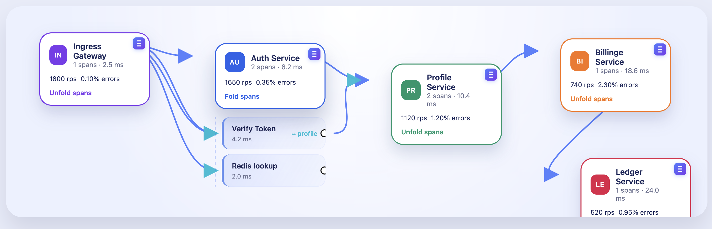

# Directed Trace Graph

A lightweight React + Vite playground that renders an animated left-to-right
trace visualization. Each service node can unfold into its spans, and the spans
emit animated connectors to downstream services.

## Features

- **Hierarchical Layout**: Services positioned left-to-right based on trace dependencies
- **Interactive Nodes**: Click services to expand/collapse spans
- **Drag & Drop**: Reposition services anywhere with the top-right handle

## Screenshot



## Getting Started

```bash
pnpm install   # or npm/yarn
pnpm dev
```

Open the Vite dev server URL and click on any service node to unfold its spans.
The `TraceGraph` component lives in `src/components/TraceGraph.tsx`.

## Controls

| Action | Shortcut |
|--------|----------|
| Expand/Collapse Service | Click service card |
| Drag Service | Grab top-right handle, drag anywhere |
| Zoom In | `Ctrl + Scroll Up` (or `Cmd + Scroll` on Mac) |
| Zoom Out | `Ctrl + Scroll Down` |
| Pan View | `Shift + Scroll` |

